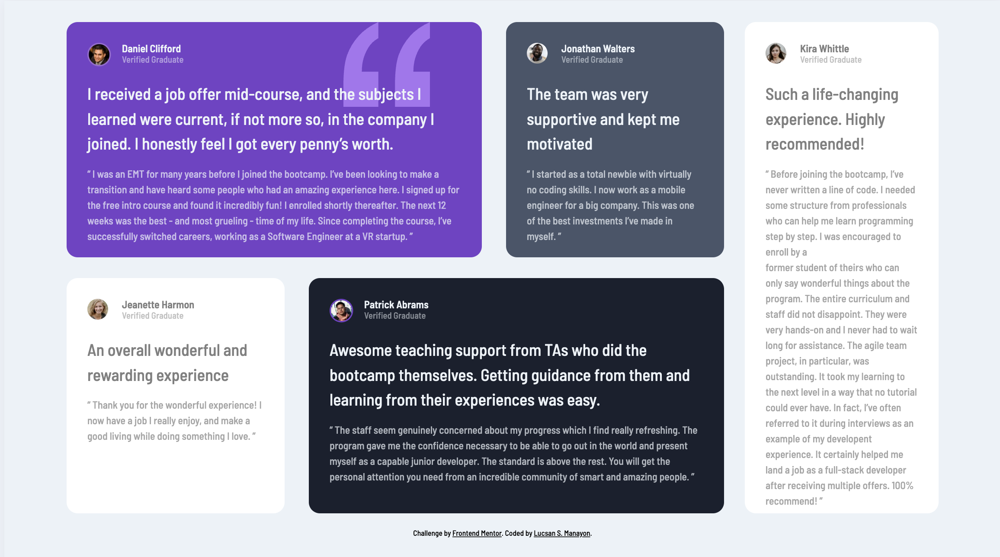
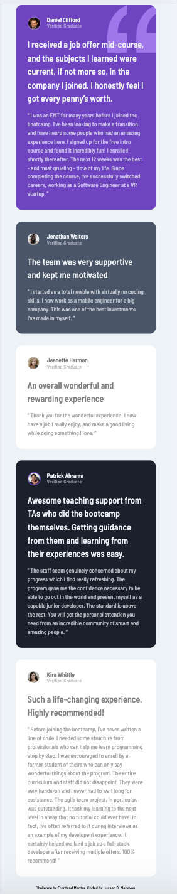

# Frontend Mentor - Testimonials grid section solution

This is a solution to the [Testimonials grid section challenge on Frontend Mentor](https://www.frontendmentor.io/challenges/testimonials-grid-section-Nnw6J7Un7). Frontend Mentor challenges help you improve your coding skills by building realistic projects.

## Table of contents

- [Overview](#overview)
  - [The challenge](#the-challenge)
  - [Screenshot](#screenshot)
  - [Links](#links)
- [My process](#my-process)
  - [Built with](#built-with)
  - [What I learned](#what-i-learned)
  - [Continued development](#continued-development)
  - [Useful resources](#useful-resources)
- [Author](#author)

## Overview

This project is a solution to the Testimonials Grid Section Challenge on Frontend Mentor. The challenge is part of a series designed to improve coding skills through hands-on, realistic projects. The task involves building a testimonials grid section that meets specific design criteria. The project serves as a practical opportunity to enhance web design skills, particularly in creating responsive layouts.

### The challenge

Users should be able to:

- View the optimal layout for the site depending on their device's screen size

### Screenshot

### Links

- Solution URL: [ljmanayon/testimonials-grid-section](https://github.com/ljmanayon/testimonials-grid-section)
- Live Site URL: [ljmanayon.github.io/testimonials-grid-section](https://ljmanayon.github.io/testimonials-grid-section/)

## My process

1. **Start with Mobile View:** The first step in my workflow is designing for the mobile view. This involves creating a responsive design that works well on smaller screens. I focus on the layout, ensuring that all elements are viewable and user-friendly on a mobile device.
2. **Progress to Desktop View:** After the mobile view has been designed and tested, I then scale up to a desktop view. This involves adapting the layout to take advantage of the larger screen space, while maintaining the same core design elements.
3. **Iterate and Refine:** The next stage involves iteration and refinement. I test the design on various devices and screen sizes, making necessary adjustments to ensure that the design is truly responsive.
4. **Summarize:** Finally, I summarize the process and the outcome. This involves documenting the decisions made during the design process, the challenges faced, and how they were overcome, as well as any improvements that could be made in future projects.

### Built with

- Semantic HTML5 markup
- CSS custom properties
- CSS Grid
- Mobile-first workflow

### What I learned

One of the most transformative learning experiences I've had recently was with CSS Grid. Despite the initial challenges I faced in understanding its complex syntax and the logic behind grid-based layouts, I am now confident in my ability to use it effectively in my projects.

When I first started using CSS Grid, I found it difficult to grasp how to structure a grid layout and how to place items within the grid. The concept of grid lines, grid tracks, and grid areas was completely new to me, and I often found myself confused and frustrated.

### Continued development

I will continue to learn about HTML and CSS then move up to JS once I'm really confortable on the frist two

### Useful resources

- [interacive guide to grid](https://www.joshwcomeau.com/css/interactive-guide-to-grid/)

## Author

- Website - [Lucsan S. Manayon](https://github.com/ljmanayon/testimonials-grid-section)
- Frontend Mentor - [@ljmanayon](https://www.frontendmentor.io/profile/ljmanayon)
